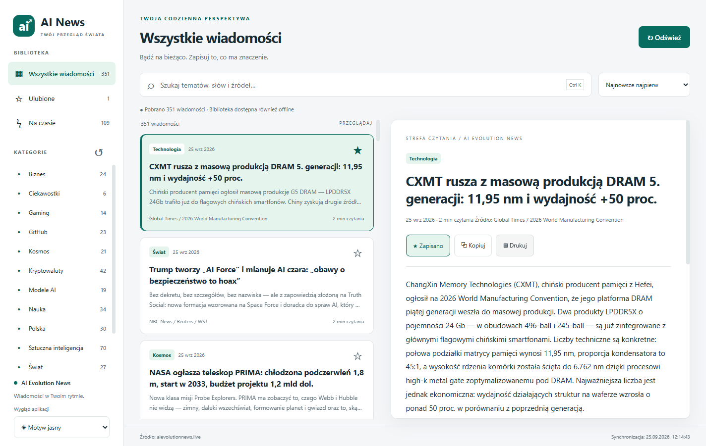
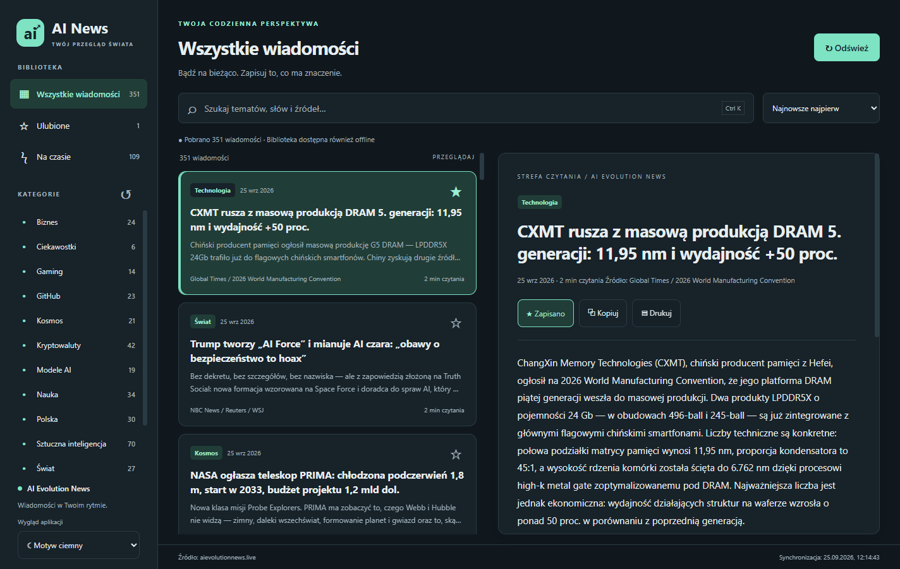

# AI News — czytnik wiadomości dla Windows


**[Pobierz najnowsze wydanie dla Windows](https://github.com/zetmar-collab/ai-news-desktop/releases/latest)**

Gotowa aplikacja: `release/AI-News-1.0.0-Windows.exe`. Uruchom dwuklikiem, bez instalowania Node.js. Przy pierwszym uruchomieniu wymagane jest połączenie z internetem. Wersja przenośna zapisuje bibliotekę w profilu Windows, nie obok EXE.

## Funkcje
- Pobieranie pełnych postów z https://aievolutionnews.live/api/news przy uruchomieniu i przyciskiem Odśwież.
- Kategorie, wyszukiwanie w treści, tytule, źródle i tagach (bez rozróżniania polskich znaków).
- Sortowanie datą w obu kierunkach oraz tytułem A–Z / Z–A.
- Wszystkie wiadomości, Na czasie i Ulubione. Gwiazdka zapisuje pełny post lokalnie.
- Czytnik pełnej treści, schowek Windows z tekstem i linkiem, systemowe okno drukowania.
- Motyw jasny, ciemny i zgodny z systemem, zapamiętywany po zamknięciu.
- Ostatnio pobrane dane i ulubione dostępne offline. Błąd połączenia nie usuwa biblioteki.
- Ctrl+K: wyszukiwarka, Ctrl+R: odświeżanie, Ctrl+P: wydruk wybranego posta.

## Dane i prywatność
Biblioteka: `%APPDATA%/ai-news-desktop/library.json` (ścieżka domyślna Electron wynikająca z nazwy pakietu). Plik zawiera ostatni pobrany zestaw, pełne kopie ulubionych i ustawienie motywu. Możesz utworzyć jego kopię po zamknięciu aplikacji. Aplikacja nie wymaga konta i nie wysyła ulubionych na serwer. Nie pobiera zewnętrznych obrazów ani fontów.

Treści pochodzą z AI Evolution News i pozostają własnością ich autorów. Aplikacja pokazuje je bez weryfikacji merytorycznej. Serwis deklaruje automatyczne opracowanie z użyciem AI. Nie jest to oficjalna aplikacja wydawcy serwisu.

## Architektura
```text
Interfejs HTML/CSS/JS → ograniczone API preload → proces główny Electron
                                              ├─ HTTPS → API AI Evolution News
                                              ├─ Store → atomowy zapis JSON
                                              ├─ Schowek Windows
                                              └─ oddzielne okno wydruku → drukarka / Microsoft Print to PDF
```
Electron zapewnia spójne renderowanie i obsługę drukowania na Windows, kosztem większego pakietu niż Tauri. W tym projekcie nie ma kompilatora Rust. Dla biblioteki kilkuset tekstów wystarcza lokalny JSON; SQLite może być kolejnym krokiem przy znacznym wzroście archiwum.

## Struktura
- `src/main.cjs` — okno, integracja HTTPS, IPC i funkcje systemowe.
- `src/preload.cjs` — siedem ograniczonych operacji dostępnych dla interfejsu.
- `src/domain.cjs` — walidacja danych, format schowka i bezpieczny HTML wydruku.
- `src/store.cjs` — kolejka i atomowy zapis biblioteki.
- `src/renderer.js`, `index.html`, `styles.css` — widoki i motywy.
- `tests/` — testy domeny, trwałości oraz integracji z działającym Electron.
- `docs/` — kontrakty i system wizualny.
- `examples/sample-news.json` — fikcyjny przykład kontraktu API; nie jest używany jako dane aplikacji.

## Budowanie
Windows x64, Node.js 22 lub nowszy i npm:
```powershell
npm.cmd ci
npm.cmd start
npm.cmd test
npm.cmd run test:ui
npm.cmd run build
```

## Microsoft Store

W katalogu `store-identity.example.json` znajduje się wzór danych wymaganych po zarezerwowaniu nazwy aplikacji w Partner Center. Skopiuj go do nieśledzonego przez Git pliku `store-identity.json`, wklej dokładne `Identity name` i `Publisher` z Partner Center, a następnie uruchom:

```powershell
npm.cmd run build:msix
npm.cmd run test:msix
```

Wynikiem jest `release/AI-News-<wersja>-Windows-x64.msix`. Do Microsoft Store nie podpisuj go własnym certyfikatem — Partner Center podpisuje pakiet podczas publikacji.
Test interfejsu korzysta z rzeczywistego API i potrzebuje internetu. Uruchamia ukryte okno z oddzielnym tymczasowym profilem, więc nie zmienia biblioteki użytkownika. Zrzuty i przykładowy PDF trafiają do `test-results/`.

## Publikacja
Wynik: `release/AI-News-1.0.0-Windows.exe`. To lokalna kompilacja bez podpisu cyfrowego. Windows może wyświetlić ostrzeżenie o nieznanym wydawcy. Do publicznej dystrybucji skonfiguruj certyfikat podpisujący w electron-builder. Aktualizacje w tej wersji są ręczne — zastąp EXE nowym, zachowując profil danych.

## Testy i ograniczenia
Testy jednostkowe sprawdzają walidację API, duplikaty, kodowanie HTML, polskie znaki, równoległe zapisy, restart oraz ochronę uszkodzonej biblioteki. Test integracyjny sprawdza pobieranie prawdziwych postów, czytnik, ulubione, schowek, wyszukiwanie, sortowanie, oba motywy i ponowny start. Wydruk jest renderowany do PDF przez Electron; testy nie wysyłają niczego do fizycznej drukarki. API nie ma udokumentowanego publicznego kontraktu — jego zmiana może wymagać aktualizacji adaptera.

Możliwe rozszerzenia: eksport biblioteki, archiwum SQLite i podpisane automatyczne aktualizacje.

## Wygląd

### Motyw jasny



### Motyw ciemny


